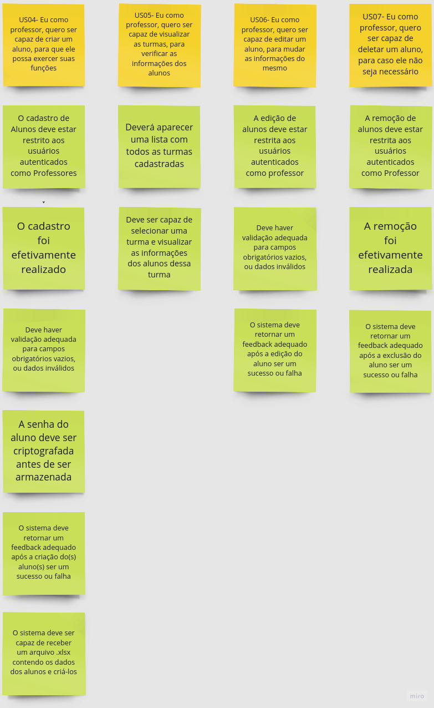
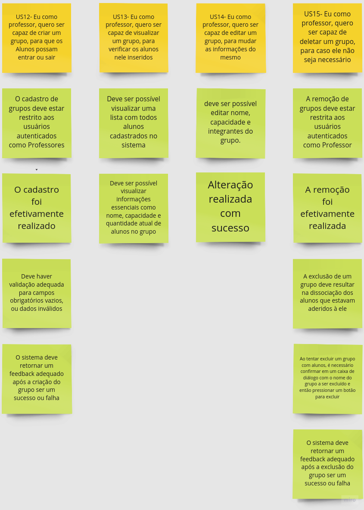
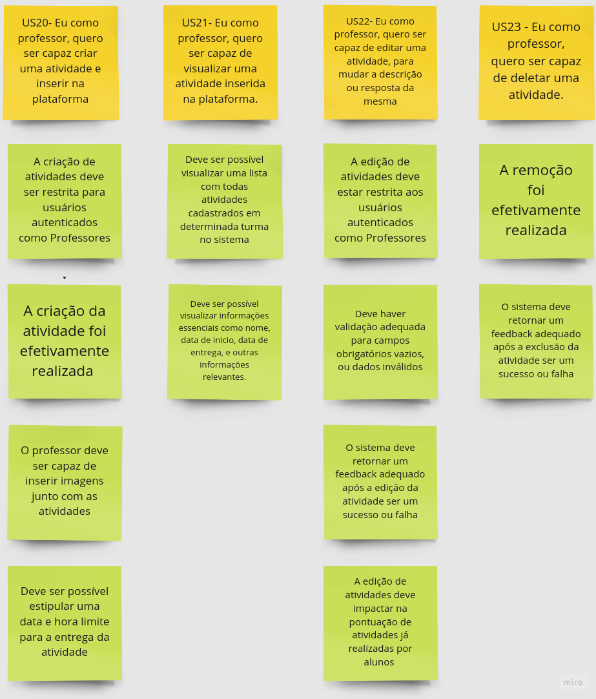
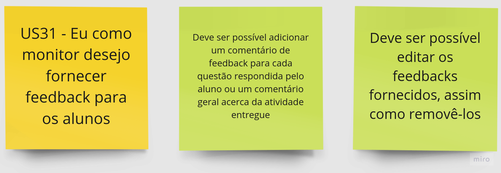
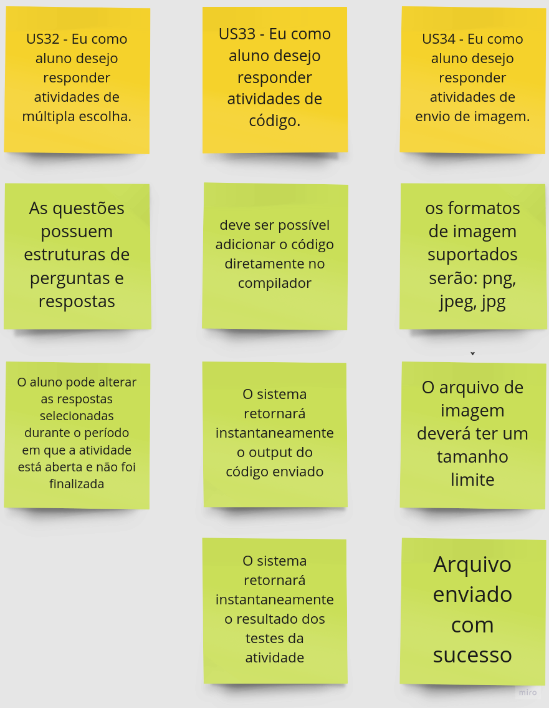
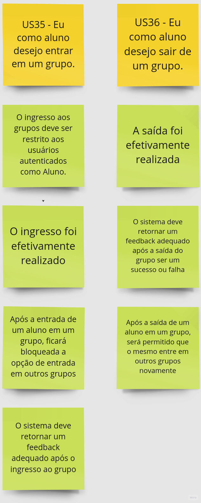

# Critérios de Aceitação
Critérios de aceitação são fundamentais no processo de Desenvolvimento de *Software*, fornecendo definições claras e objetivas que definem quando determinada funcionalidade ou requisito é considerado satisfatoriamente implementado. Esses critérios são estabelecidos em colaboração com os *stakeholder(s)*, cliente(s), usuário(s) e membro(s) da equipe de desenvolvimento, para garantir uma compreensão comum das expectativas e padrões de qualidade esperados.

As imagens a seguir, apresentam os Critérios de Aceitação para cada uma das Histórias de Usuários presentes no *MVP*, provisoriamente definidos pelo time e *stakeholder(s)* na Missão 2.

## Critérios de Aceitação FE01 - CRUD Turma
{: style="height:auto", width="100%"}

## Critérios de Aceitação FE02 - CRUD Aluno
{: style="height:auto", width="100%"}

## Critérios de Aceitação FE03 - CRUD Monitor
{: style="height:auto", width="100%"}

## Critérios de Aceitação FE04 - CRUD Grupo
{: style="height:auto", width="100%"}

## Critérios de Aceitação FE05 - CRUD Conteúdo
Não entrou no MVP.  

## Critérios de Aceitação FE06 - CRUD Atividade
{: style="height:auto", width="100%"}

## Critérios de Aceitação FE07 - Emitir Planilhas
{: style="height:auto", width="100%"}

## Critérios de Aceitação FE08 - Corrigir Atividades
{: style="height:auto", width="100%"}

## Critérios de Aceitação FE09 - CRUD Professor
{: style="height:auto", width="100%"}

<!-- 
<strong>Tabela 1: Dados de vendas</strong>
 -->

## Critérios de Aceitação FE10 - Inserir Feedback
{: style="height:auto", width="100%"}

## Critérios de Aceitação FE11 - Submeter Atividades
{: style="height:auto", width="100%"}

## Critérios de Aceitação FE12 - Entrar e Sair de Grupos
{: style="height:auto", width="100%"}

## Critérios de Aceitação FE13 - Visualizar e Baixar Conteúdos
Não entrou no MVP.  
