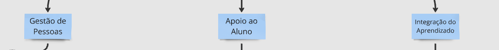
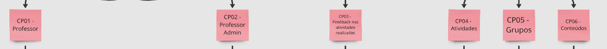
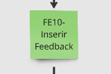
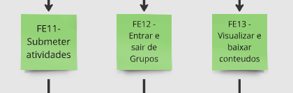

# Diagrama SAFe
O diagrama SAFe (Scaled Agile Framework) é uma visualização das práticas e princípios do SAFe, utilizado para aplicar metodologias ágeis em grandes organizações. Ele facilita a coordenação entre múltiplos times para entrega contínua de valor.

{: style="height:auto", width="100%"}

## Tema Estratégico
Dividido de acordo com as áreas do sistema.

{: style="height:auto", width="100%"}

## Épicos
Representam os principais marcos do nosso projeto.

{: style="height:auto", width="100%"}

## Capacidades

Estão dividos de acordo com as funcionalidades de nível alto que fornecem valor significativo para os stakeholders.

{: style="height:auto", width="100%"}

## Features

Funcionalidades de médio porte que entregam valor direto aos stakeholders.

### Features - Professor e Professor Admin
{: style="height:auto", width="100%"}

### Features - Monitor
{: style="height:auto", width="100%"}

### Features - Alunos
{: style="height:auto", width="100%"}